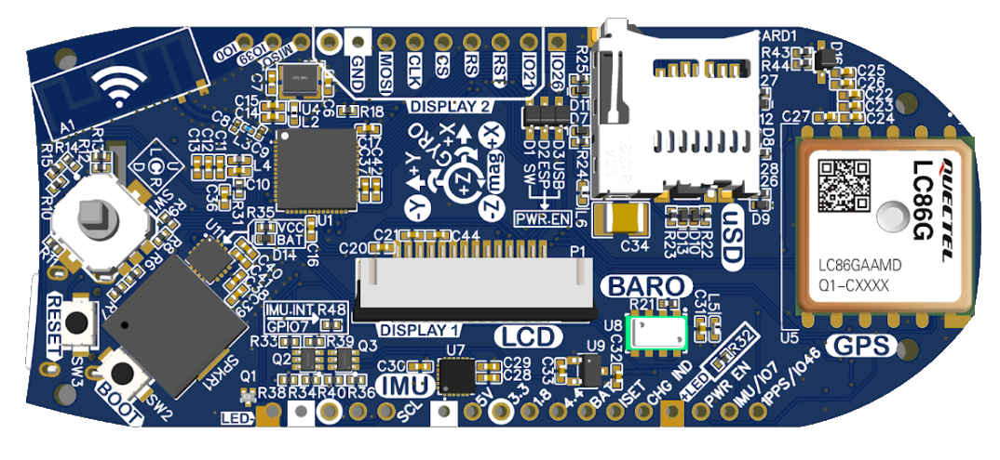

# leaf development platform

## Introduction

TODO: populate

## Origin story

The Leaf was created first as a paragliding variometer ("vario" for short).  Varios are flight instruments - essentially digital cockpits - that track altitude changes and alert the pilot if they're in a rising thermal or sinking air.  More advanced varios include a GPS for monitoring ground speed, glide ratios, and tracking the flightpath in a log file.  Varios are used by sailplane and hot air balloon pilots as well.

While there are several varios on the market, they mostly fall into the "advanced" category (often being larger and much more expensive), or "simple" category (attractively small, light, and inexpensive, but lacking key features).

There isn't a "just right" option, combining affordability and small size, with more advanced features. Leaf was born to fill this need.

## Other use cases

This "gap" in the market for paragliding varios isn't unique.  Many smaller sports, activities, and hobbies don't have the market size to attract big-names to create the perfect device.  It's precisely in these more niche-market use cases where the maker community can step up to fill the gap.

Leaf happens to be aimed at paragliding and other air sports, but its collection of electronic components and sensors are widely applicable to many other uses.  

Maybe a battery-powered IOT sensor backbone with wifi.  Or a tracking device for your remote controlled vehicles or drones.  Maybe an inclinometer for 4x4 offroading to track and alert of pitch/roll angles while also saving a GPS log of your route.

## Why Leaf, though?

Similar to the gap in the paragliding market, there is also a bit of a gap in the maker space market.  There are plenty of dev kits, shields, and plug-in sensors.  And there are also plenty of finished products sold by big-name retailers.  But what about in between?  What about the process of going from dev kits and shields toward a finished product?

Perhaps the Leaf can help fill that gap!

Leaf isn't just trying to be an all-in-one dev board.  Leaf aims to help users toward a finished product design, with considerations such as:

* Overall system architecture designed to maximize the use of the ESP32 processor
* Battery and charger solution designed for portable use cases (the entire product is sized around a standard 103450 lipo cell)
* User interface elements for a complete experience, such as screen, speaker, and 5-way switch
* Custom injection molded plastic case
    * Mounting options include a slot for a velcro strap, and also an additional slide-in base plate, making hot-swaps easy while still returning the Leaf to the exact position if required - for example maintaining IMU calibration angles
    * And for an example of how the design prioritizes developers: the "reset" and "boot" switches are accessible through the speaker grille so you can reset and program the device without removing the case!

If someone is looking to bring their project to the next level of maturity, it may be easier to start with the Leaf.  If the sensors and components are sufficient, it may only require additional software work.  Or, they can use the I2C connector and additional header pins to add functionality.  Or, start with the open source PCB files and add their necessary components straight to the existing design (much easier than starting from scratch).  Even if the application requires (for example) a different display  size, the open-source plastic case CAD files can be modified, then 3D printed.  Again, it's much easier to start from an existing solution.

## Ultimate vision

If your project needs a powerful Arduino-compatible processor with wireless support, a handful of popular sensors/peripherals, and a user interface with a screen and buttons... then it's likely that Leaf might fit the bill - while being cheaper and faster to bring-up than buying individual components separately.  Plus, you're able to get the look and feel of a finished product with the overall design and case.  And it's about as compact as you can get!

In an ideal world, Leaf grows into a mini ecosystem, with open source firmware available for numerous use-cases and product types, as well as community-driven mods for new hardware designs, both for the PCBA as well as the plastic case.
