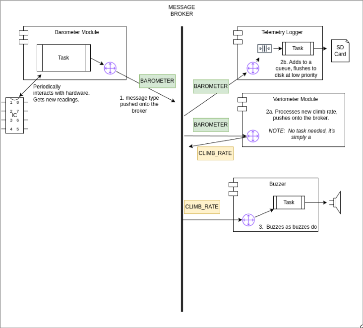

# Restructure Design Patterns

## Problem Statement

I often find it hard to know where or why something is sitting in various classes in the Leaf project today. There’s a lot of Button IO processing that tries to re-render screens, a logging module that’s called regardless if new GPS data is available. It’s just generally a tiny bit spaghetti like.

We have another problem where everything is in one main event loop. A blocking call (like writing telemetry) is able to back the entire event loop up and we get warning messages in our “Baro” class, saying “not called for 8,000ms” as I guess we’re processing something expensive. Ideally, if the CPU needs to collect another measurement, it should drop what it’s doing to do so.

Lastly, when developing a new feature, we wanted to be able to “replay” collected data back through the system. Today, we’d need to modify all of the modules to work with a telemetry replayer, so, it’s squarely in the “too hard” basket.

I plan on solving all of this with:

- FreeRTOS Tasks
  - Each module has its own Task, with its own priority. Things that the user interact with should be top priority. Things that collect data to update instruments crucial to pilot climb feedback should be the next highest. Updating any misc data like air traffic or weather comes after. Lastly, are our low-pri tasks like writing telemetry and flight log data to disk.
- Message Brokers
  - Using [ETL Message Bus](https://www.etlcpp.com/message_bus.html)
  - Modules are able to listen to messages of given messages types on a shared bus.
  - Actions could be taken to put this into a queue for later processing, or perhaps update some global state and wake up a task to allow them to process it.

## Example: Climb Rate

The vario beeps when we’re going up. A top priority of buying a vario is to ensure it’s letting you know when there’s lift. So a view of how it may interact will look something like this:

The ability to replay, would be as simple as unsubscribing the Telemetry Logger from the broker, suspending the barometer module, and perhaps creating a “telemetry replayer” task to send Barometer readings into the system from disk, allowing us to play with swapping out the Variometer algorithm, or the buzzer pitch control algorithms.

## FAQ

**How do I put messages on the bus?**

The main module when initializing the process should pass a pointer to the bus into any modules that need it. You can call "receive" on the bus

**Is the bus thread safe?**

We've sub-classed the etl-bus, making "receive" calls safe by locking a mutex

**How do I receive messages on a bus?**

Subclass a [Message Router](https://www.etlcpp.com/message_router.html) in your module and have the manager subscribe it to the bus. Please don't do any expensive operations in the receive. In case lots of time is needed by receiving a message, you should be queuing the message for your module to process.

**Can I just use global variables?**

Yep, there's nothing needing you to use messages on the bus. If you just want to pull off the latest state like climb rate periodically, go for it! I suspect as we migrate more and more things over, we'll rely less on global variables.
