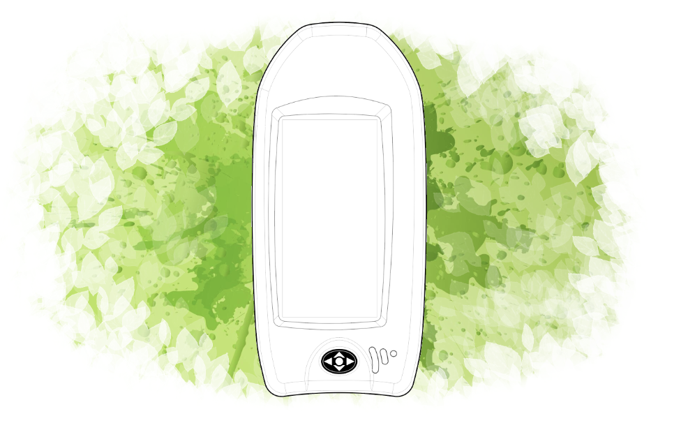
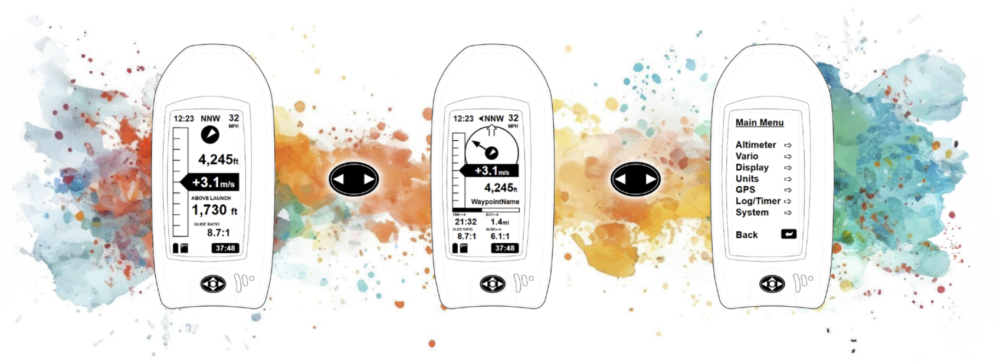
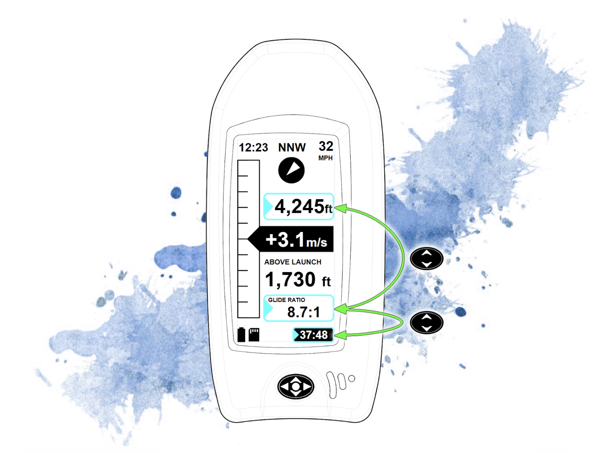
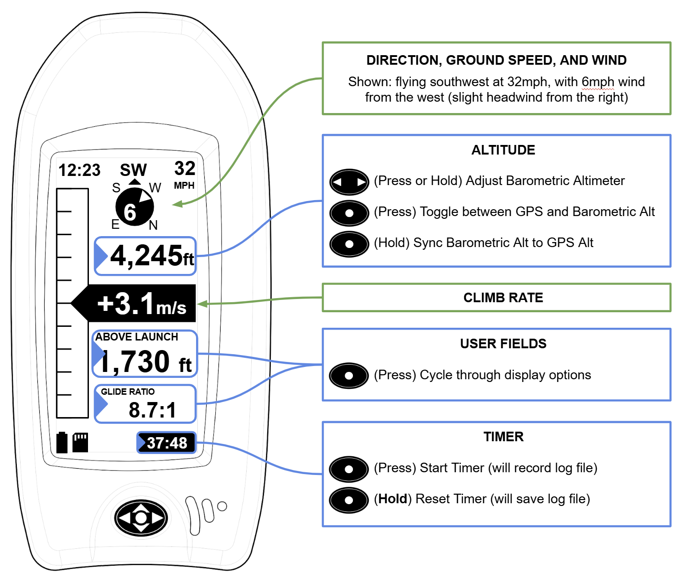
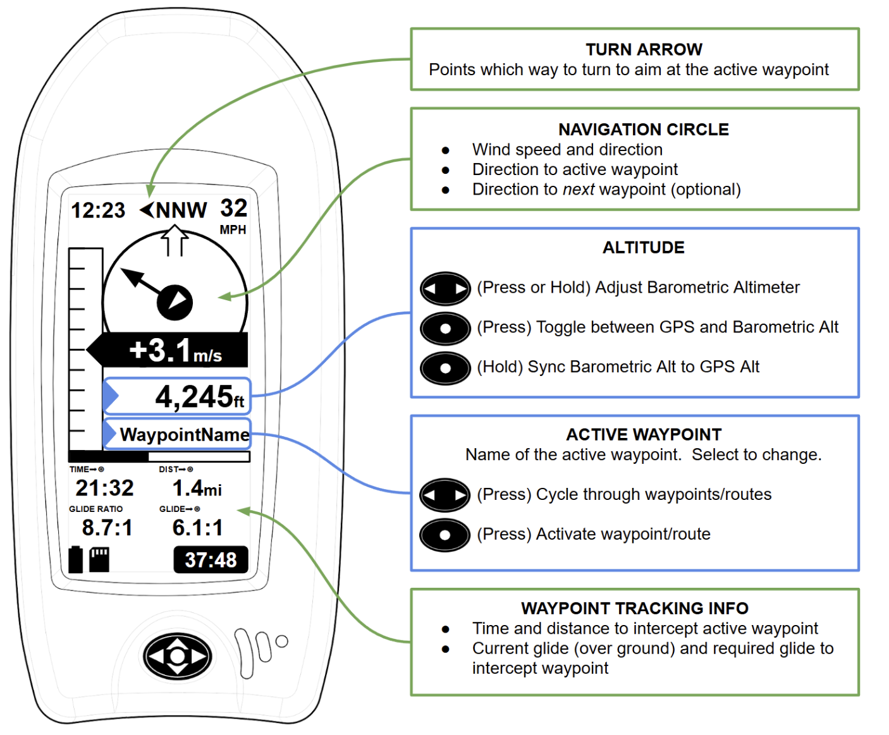
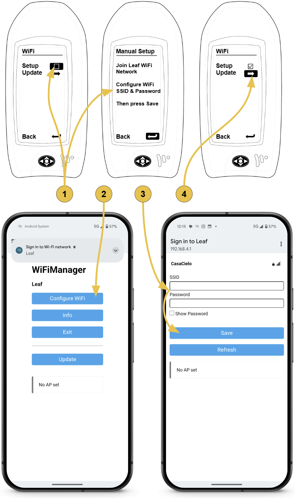

import style from "./style.css"

    

    

# Quick Start Guide

1. [Getting Around](#getting-around)
2. [SD card](#sd-card)
3. [Firmware Updates](#wifi-firmware-updates)

## Getting Around

Meet the Directional Pad:

|||
|---|---|
|| You control the Leaf with this 5-way switch by pressing  UP, DOWN, LEFT, RIGHT, and CENTER |
|| Turn Leaf ON and OFF by holding CENTER|
|| Use LEFT and RIGHT to scroll through the pages|

All the way to the right you’ll find the MENU page:

    

|||
| --------------------------------------- | ----------------------------------------------------------------------------------------------------------------- |
| | Within a page, use UP and DOWN to scroll through the options                                                      |
|            | A cursor selection box will highlight adjustable fields                                                           |
|      | When selected, press CENTER to select or adjust that option                                                       |
| For Example, Press CENTER to:      | * Start the timer (**HOLD** CENTER to stop)  * Cylce through display options in the Altitude or User fields |

|||
| ------------------------------------ | -------------------------------------------------------------------------------------------- |
|  | In a few cases, you can use LEFT and RIGHT on an option as well                              |
| For Examples, Press L/R to:     | * Adjust the barometric altimeter * Scroll through waypoints and routes on the NAV page |

> **Shortcut:** When MSL Altitude is selected, hold CENTER to sync the baro altitude to the GPS altitude. This is useful if you don’t know the site altitude or current pressure setting.

### Thermal Page
The  main operational page for standard vario 

    

### Nav Page

    

## SD Card

### Saving Track Logs

Flight logs will save to SD Card. Be sure to turn on the “Save Log” setting inside the Log Menu.

Logs can be saved in either KML or IGC format.

### Loading Waypoints and Routes

Loading Waypoints and Routes: When Leaf is turned on, it will look for a file named “waypoints.gpx” in the root directory of the SD card.

Create a file with this name and save it to the SD Card to access your waypoints and routes for navigation.

## WiFi Firmware Updates

Leaf can update to the latest firmware over WiFi. To configure the Leaf WiFi Settings, you’ll need another device (phone or computer).

Here’s the process:

1.  Enter the Manual WiFi Setup Mode on Leaf:

    Main Menu➡System➡WiFi➡Setup➡Manual

> **Note:** You will also see options to configure Leaf using an iPhone or Android App. These methods are not yet documented.

2.  Using your other device, find and join the “Leaf” WiFi Network. This should bring up a WiFi Manager page (you may first need to click “Sign in to WiFi Network” on your device).

    Click “Configure Wifi”

3.  Enter your WiFi Network name (SSID) and password. Remember the SSID and password fields are Case Sensitive.
   
   Click “Save”.

Leaf will then attempt to connect to your WiFi Network. If successful, Leaf will automatically exit the "Manual Setup" page, and show a checkmark in the Setup box.

4.  Now click “update” on Leaf to automatically check for and download the latest firmware. Leaf will restart when finished checking and/or updating.

    

### NOTE: For Updates In-The-Field

If WiFi is not available and you would like to use your cellular internet connection to update Leaf, follow these steps:

1.  Turn on and configure your WiFi Hotspot feature on your phone/device. Be sure to remember the SSID Name and Password.
2.  Follow steps #1-3 above to connect to the Leaf Network and enter your Hotspot information into the Leaf WiFi Manager. Note that connecting to the Leaf Network on your device will likely automatically turn off your Hotspot feature. This is ok.
3.  Immediately after clicking “save” in Step #3, again turn on your device’s Hotspot Feature.
4.  Leaf will try to connect to the Hotspot network. If successful, update Leaf firmware as described in step #4 above.
5.  Once Leaf has updated and restarted, you can turn off your Hotspot feature.

