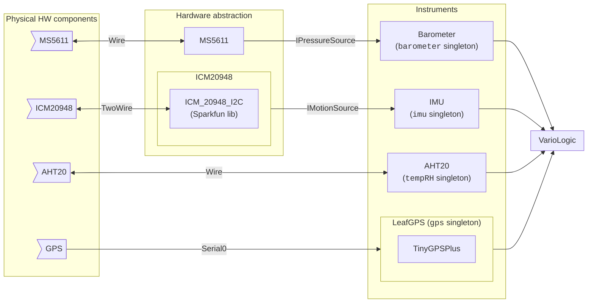

## Required libraries

See list of required libraries in the `libraries` section of the [Arduino workflow](../../.github/workflows/arduino.yaml).

## ESP32 configuration

ESP Board Manager Package 3.0.2

- USB CDC On Boot -> "Enabled"
- Flash Size -> 8MB
- Partition Scheme -> 8M with spiffs (3MB APP/1.5MB SPIFFS)

Arduino board: ESP32S3 Dev Module

(see [Arduino workflow](../../.github/workflows/arduino.yaml) to confirm specifics)

## Programming with PlatformIO

See [leaf README](../README.md)

## Programming with Arduino

To program the current hardware:

- Install Arduino IDE and [ESP Board Manager Package](#esp32-configuration)
- Install [required libraries](#required-libraries)
- Plug board into USB
- Select the [appropriate board](#esp32-configuration) and port in the Arduino IDE
- Configure the [appropriate board settings](#esp32-configuration)

## Notes

tried but not going to use:

- NeoGPS: 4.2.9
  -> change GPSport.h to define HWSerial:
  #define gpsPort Serial0
  #define GPS_PORT_NAME "Serial0"
  #define DEBUG_PORT Serial
  -> enable PARSE_GSV string and PARSE_SATELLITES and PARSE_SATELLITE_INFO
  -> enable NMEAGPS_INTERRUPT_PROCESSING
- ICM20948_WE
- AdaFruit ICM20948 (and associated dependencies)

## System diagram

