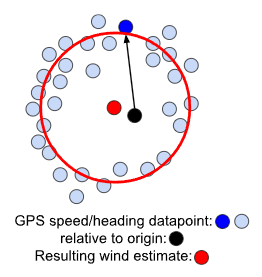
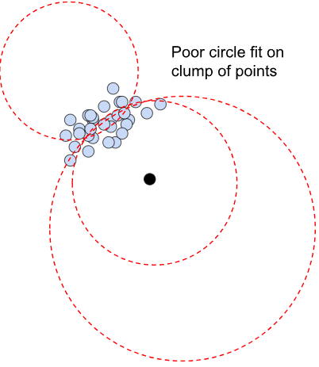
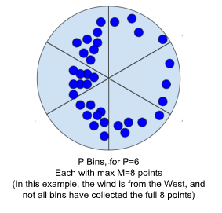
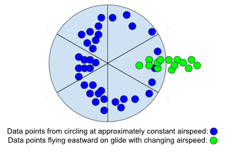
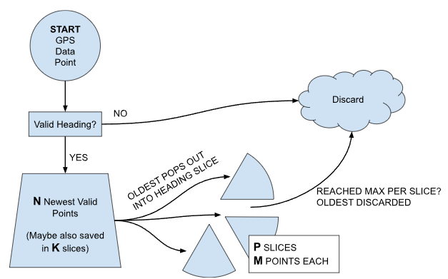
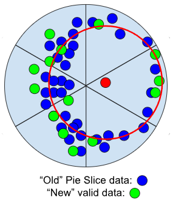

# Wind Estimate

## How we calculate an estimate
The wind estimate is based on GPS ground speed vectors, each with a magnitude (velocity/speed) and ground track angle (“track”).

By fitting a circle to the data points and finding the center (red), we can infer the wind speed and direction.

The wind estimate is most accurate when we have datapoints at multiple different tracks.  In many cases, users may fly in a “straight-ish” direction for awhile, and not have many, or any, recent datapoints from multiple different tracks. 

Fitting a circle to a clump of datapoints in one place has poor results.  In this case, we assert that it’s more valuable to have an older, but accurate, wind estimate, compared to a newer, but less accurate estimate.

## Accuracy Over Time

To maintain an “accurate, if older” estimate, will save older/historical data by breaking up the track angle/compass circle into P pie slices, or bins (say, P=6).  For each bin, we will save the M most recent data points in that bin (say, M=8), for a maximum total of P*M total “historical” points.  Not all bins may have 8 datapoints, if we have not yet collected a full 8 data points in that bin.  But if more than 8 datapoints are collected in a bin, the newest 8 are retained as the older ones are dropped out.  It could be that some data points will be several minutes, or maybe even hours old, depending on the flight track.  But each time the pilot flies in a circle or two, a large amount of the data should be refreshed.

   

Saving data in this way ensures that, as long as enough data points have been collected “around the circle” at least once, a reasonable wind estimate will always be available.

## Incorporating Recent Data Too

However, we do wish to also use more recent data when available.  In fact, a reasonable wind estimate can often be obtained with datapoints in just one half of the circle or so.  Imagine flying at a westerly-facing coastal ridge site where most of the measured vectors are North and South up and down the coast or out West toward the ocean.  Maybe we also have some older, Easterly tracking data points from a 360 turn we did half an hour ago.  In this case, we may have a hemisphere of newer data (the west-half) that would be averaged equally against a much older hemisphere of old data (the east-half).

To help improve this situation and create a more accurate and recent wind estimate, we will also include our most recent N newest and valid data points (say N=30).  This allows us to add some extra averaging weight on our most recent data.

### Not being misled
A key aspect of the N newest data points is that they are *valid* and not too redundant.  This is another check to ensure that the newest data points don’t decrease or break the accuracy of the wind estimate.  Consider the case of circling in a thermal and then going on a long straight flight to the next waypoint – perhaps a straight segment of 30 minutes or more!  During this straight flight, the user may get on speedbar in sink, and slow down in lift, but still maintain a relatively constant heading.  These newer data points would radically decrease the accuracy of the wind estimate, compared to the data from circling in the thermal.

So, the “validity check” we will perform on these N newest data points is to ensure we don’t have too many points all with similar tracks.  In fact, we would most prefer points obtained while changing track angle(i.e., turn rate or rate of track change is above some minimum).  There are a few approaches we could take here:

##### Option 1
only allow a new point into the N newest points if the track is at least θ degrees different than the most recently saved N point.  This is simple, and if θ is a reasonable value around 5~10 degrees, we shouldn’t accumulate too many points from straight-line flights.  The downside is we still might get a handful of points (or more) in approximately the same direction if the flight track is wavy or has slight S-turns.

##### Option 2
maintain a second “cake slice bin” array for the N points, with K bins – except there would be many more, narrower, bins than before (perhaps K = 72, resulting in 5-degree bins) AND we would only allow 1 new point per bin.  The drawback is some added complication maintaining a second bin array, but the benefit is more appropriate validity checking of the points.  If you fly a mostly-straight track, but S-turn or weave back and forth slightly by more then 5~10 degrees (θ in option 1), you wouldn’t keep accumulating new points in N, you would just keep overwriting the ~2 datapoints you have in those adjacent K cake slices.  However, if you turned and swept your track through 180 degrees, you could have all N points freshly validated and added to the wind estimate.

##### Option 3?
 perhaps there are other options too.
 
 ## Data Handling and Flow Chart

Regardless of the method, once we perform a successful validity check, we will save the point into the N newest.  If/when that array is full, the oldest will drop out of N and then be saved into the “historical” pie slice data.  Then, once any particular pie slice has reached the max M of points, each new point in that slice will push out the oldest to be discarded.

## Final Wind Estimate

Ultimately, the older pie-slice data (M points * P pie slice bins) will be combined with the newest N valid points, to create a resulting wind estimate.

